# Z-Image × Fuliji — Fine-tuning Exploration

<p align="center">
  <a href="https://huggingface.co/DownFlow/Z-Image-Turbo-Fuli"></a>
  <a href="https://huggingface.co/datasets/DownFlow/fuliji"></a>
  <a href="https://huggingface.co/Tongyi-MAI/Z-Image-Turbo"></a>
  <a href="https://huggingface.co/Tongyi-MAI/Z-Image"></a>
  
  
</p>

---

## Abstract

This project explores how both **Z-Image** (50-step, CFG-enabled) and **Z-Image Turbo** (8-step, CFG-free) — single-stream diffusion transformers sharing the same S3-DiT architecture — can be fine-tuned on the **Fuliji dataset** ([`DownFlow/fuliji`](https://huggingface.co/datasets/DownFlow/fuliji)), a curated collection of 1177 images spanning 405 artists.

We run experiments on both models across three complementary strategies:

| Stage | Method | Models | Goal |
|---|---|---|---|
| **2** | Residual-stream abliteration | Z-Image | Remove refusal behaviour via direction subtraction |
| **3B** | Full fine-tune (all weights) | Z-Image + Turbo | Domain adaptation to Fuliji style/content |
| **3D** | Artist identity LoRA | Z-Image + **Turbo** | Teach artist trigger tokens (rank-32 PEFT) |

Both base and Turbo artist LoRA runs were completed:
- **`lora_artist_run01`** — Z-Image base, 1177 images, 405 artists, 2000 steps
- **`lora_artist_turbo_run01`** — Z-Image Turbo, 200 images, 8 artists (≥21 images), 3000 steps → **`DownFlow/Z-Image-Turbo-Fuli`**

Quick start with the published Turbo adapter:

```python
from peft import PeftModel
from diffusers import ZImagePipeline
import torch

pipe = ZImagePipeline.from_pretrained("Tongyi-MAI/Z-Image-Turbo", torch_dtype=torch.bfloat16)
pipe.transformer = PeftModel.from_pretrained(pipe.transformer, "DownFlow/Z-Image-Turbo-Fuli")
pipe = pipe.to("cuda")
image = pipe("portrait of 年年, long_hair, black_hair, elegant", num_inference_steps=8).images[0]
```

**Key findings:**
- Both Z-Image and Z-Image Turbo are fine-tuneable with LoRA (~39M trainable params, 0.3% of 12B)
- Base model (50-step) shows stronger identity recall at equivalent steps vs Turbo (8-step)
- Turbo LoRA: artist identity emerges at ~1000 steps, converges around 2500–3000 steps
- `--lora_scale 2.0` improves Turbo identity recall without visible artefacts at 8-step inference
- Abliteration (Stage 2) suppresses refusal behaviour with minimal quality impact at α≤0.1

---


## 1. Model Architecture

### 1.1 S3-DiT: Single-Stream Diffusion Transformer

Both models use a **Single-Stream DiT** design in which text tokens, visual semantic tokens (from the Qwen3 text encoder), and image VAE tokens are **concatenated into a single unified sequence** before entering the transformer. This is in contrast to dual-stream architectures (e.g., Stable Diffusion 3, Flux) that maintain separate text and image processing pathways.

```
                    ┌───────────────────────────────────┐
  text prompt  ──►  │  Qwen3 text encoder  (cap_embedder)│
                    └────────────────┬──────────────────┘
                                     │  text tokens
                    ┌────────────────▼──────────────────┐
  noisy image  ──►  │  VAE + patchify  (x_embedder)      │
                    └────────────────┬──────────────────┘
                                     │  image tokens
  timestep t   ──►  t_embedder ──►  adaLN signals
                                     │
                    ┌────────────────▼──────────────────┐
                    │  context_refiner  (2 blocks)        │  text refinement
                    ├───────────────────────────────────┤
                    │  S3-DiT layers 0–29  (30 blocks)   │  joint attention
                    ├───────────────────────────────────┤
                    │  noise_refiner    (2 blocks)        │  image de-noising
                    └────────────────┬──────────────────┘
                                     │  refined image tokens
                    ┌────────────────▼──────────────────┐
                    │  all_final_layer  (adaLN + linear) │  projection
                    └────────────────┬──────────────────┘
                                     ▼
                               decoded image
```

### 1.2 Shared Hyperparameters

| Parameter | Value |
|---|---|
| Model class | `ZImageTransformer2DModel` |
| Hidden dimension (`dim`) | 3840 |
| DiT layers | 30 |
| Attention heads | 30 (MHA, no GQA) |
| Context refiner blocks | 2 |
| Noise refiner blocks | 2 |
| Text encoder | Qwen3 (cap_feat_dim=2560) |
| VAE latent channels | 16 |
| QK normalization | ✅ |
| RoPE θ | 256.0 |
| Total transformer params | ~12B |

### 1.3 Differences

| Axis | Z-Image | Z-Image-Turbo |
|---|---|---|
| **Inference steps** | 28–50 | **8** |
| **CFG** | ✅ (`guidance_scale` 3–5) | ❌ (`guidance_scale=0`) |
| **Scheduler shift** | 6.0 | **3.0** |
| **Negative prompting** | ✅ | ❌ |
| **Post-training** | Pre-train + SFT | Pre-train + SFT + **Decoupled-DMD + DMDR** |
| **Fine-tunability** | ✅ | ❌ (distilled) |
| **Diversity** | High | Low |
| **Visual quality** | High | Very High |

---

## 2. Weight-Level Comparison

We loaded both transformer checkpoints into CPU memory, aligned all 521 shared weight tensors, and computed four metrics per tensor:

- **Cosine similarity**: direction alignment (1.0 = identical, 0.0 = orthogonal)
- **Relative L2 change**: `‖Δw‖ / ‖w_base‖` (0 = unchanged, 1 = changed by original norm)

### 2.1 Block Category Summary

| Component | Parameters | mean cosine ↑ | mean rel-L2 ↓ | Interpretation |
|---|---|---|---|---|
| `context_refiner` (×2) | 354M | **0.943** | 0.285 | Most preserved — text refinement is step-independent |
| `layers` 0–29 (S3-DiT) | 5.4B | **0.898** | 0.404 | Moderate uniform change |
| `noise_refiner` (×2) | 362M | **0.809** | 0.571 | Substantial change — handles completely different noise levels |
| `final_layer` | 1.2M | **0.759** | 0.607 | Heavily retuned output projection |
| `embedders` | 10.6M | **0.703** | 0.640 | Most changed — especially `t_embedder` |

> **0 out of 521 tensors are bit-identical** — every weight was touched by distillation/RL.

### 2.2 Per-Layer Cosine Similarity (DiT layers 0–29)

```
layer  0: 0.858  ████████████████████████████████████████████████████████
layer  1: 0.852  ████████████████████████████████████████████████████████████
layer  2: 0.880  ████████████████████████████████████████████████
layer  3: 0.874  ██████████████████████████████████████████████████
layer  4: 0.895  █████████████████████████████████████████
layer  5: 0.893  ██████████████████████████████████████████
layer  6: 0.909  ████████████████████████████████████
layer  7: 0.919  ████████████████████████████████
layer  8: 0.917  █████████████████████████████████
layer  9: 0.920  ████████████████████████████████
layer 10: 0.922  ███████████████████████████████   ◄ most stable
layer 11: 0.919  ████████████████████████████████
layer 12: 0.919  ████████████████████████████████
layer 13: 0.916  █████████████████████████████████
layer 14: 0.916  █████████████████████████████████
layer 15: 0.913  ██████████████████████████████████
layer 16: 0.903  ██████████████████████████████████████
layer 17: 0.915  ██████████████████████████████████
layer 18: 0.914  ██████████████████████████████████
layer 19: 0.910  ████████████████████████████████████
layer 20: 0.909  ████████████████████████████████████
layer 21: 0.908  ████████████████████████████████████
layer 22: 0.905  █████████████████████████████████████
layer 23: 0.900  ███████████████████████████████████████
layer 24: 0.895  █████████████████████████████████████████
layer 25: 0.882  ███████████████████████████████████████████████
layer 26: 0.898  ████████████████████████████████████████
layer 27: 0.882  ███████████████████████████████████████████████
layer 28: 0.835  ████████████████████████████████████████████████████████████
layer 29: 0.853  ██████████████████████████████████████████████████████████
```

The **U-shaped divergence** (more change at layers 0–3 and 26–29, least at layers 7–14) is a classic consistency distillation signature: the model adapts its entry (timestep interpretation) and exit (image structure commitment) while preserving core feature extraction.

### 2.3 Most Changed Tensors

| Tensor | cosine | rel-L2 | Why |
|---|---|---|---|
| `t_embedder.mlp.2.weight` | **0.186** | 0.983 | Timestep embed projection — completely remapped for 8-step schedule |
| `t_embedder.mlp.0.bias` | 0.368 | 0.930 | Same — entry MLP bias |
| `layers.25.adaLN_modulation.0.weight` | 0.387 | 0.928 | Adaptive LN conditioning, deep layers most affected |
| `layers.28.adaLN_modulation.0.weight` | 0.412 | 0.934 | Near-final layer conditioning |
| `all_final_layer.adaLN_modulation.1.weight` | 0.429 | 0.943 | Output head conditioning |
| `noise_refiner.*.adaLN_modulation` | 0.48–0.56 | 0.83–1.38 | Noise refiner handles different Δt magnitudes |

### 2.4 Least Changed Tensors

| Tensor | cosine | rel-L2 | Why |
|---|---|---|---|
| `layers.17.attention.norm_k.weight` | 0.9998 | 0.053 | QK norm scalars unaffected by schedule |
| `context_refiner.1.attention.norm_k.weight` | 0.9997 | 0.024 | Text side, schedule-independent |
| `layers.{14-24}.attention.norm_q/k.weight` | ~0.999 | 0.06–0.09 | Core attention geometry preserved |

### 2.5 Mechanistic Conclusion

The distillation/RL pipeline (Decoupled-DMD + DMDR) effectively performs **targeted timestep recalibration**:

1. `t_embedder` is nearly completely rewritten — it must map `t ∈ {1..8}` onto the same internal representation scale as the original `t ∈ {1..1000}`.
2. All downstream `adaLN_modulation` projections are recalibrated accordingly to produce correct adaptive LayerNorm `scale`/`shift` signals at only 8 points.
3. The core attention/FFN weights (~99.9% cosine for QK norms, ~90% for projections) are largely preserved — the fundamental feature-extraction machinery is shared.
4. `noise_refiner` diverges most among non-embedding components because it must handle 8 large denoising strides (~125 noise units each) vs 50 small ones (~20 units each).

---

## 3. Inference Comparison

### 3.1 Benchmark Setup

| | Z-Image | Z-Image-Turbo |
|---|---|---|
| Steps | 50 | 8 (9 scheduler steps → 8 DiT forwards) |
| `guidance_scale` | 4.0 | 0.0 |
| `negative_prompt` | "blurry, low quality, deformed" | — |
| Resolution | 512×512 | 512×512 |
| Seed | Fixed per prompt | Same |
| Hardware | AMD MI300X (191GB) | Same |

### 3.2 Prompt Sources

| Source | Count | Description |
|---|---|---|
| [`nateraw/parti-prompts`](https://huggingface.co/datasets/nateraw/parti-prompts) | ~70 | Curated benchmark: Abstract, Animals, Artifacts, Arts, Food, Illustrations, Indoor/Outdoor Scenes, People, Vehicles, World Knowledge |
| [`Gustavosta/stable-diffusion-prompts`](https://huggingface.co/datasets/Gustavosta/stable-diffusion-prompts) | ~15 | Style-rich community prompts |
| [`mlabonne/harmful_behaviors`](https://huggingface.co/datasets/mlabonne/harmful_behaviors) | ~8 | Adversarial/sensitive — converted to image prompts, shown as-is including any rejections |

### 3.3 Visual Comparison Gallery

Generated pairs are in [`outputs/pairs/`](outputs/pairs/). The full summary grid is at:


Individual panels follow the layout:

```
┌─────────────────────────────────────────────────────────┐
│  #N  [source]  Category                                  │ ← index + metadata
├─────────────────────────────────────────────────────────┤
│  prompt text (up to 3 lines)                             │ ← dark bg, yellow if sensitive
├──────────────────────────┬──────────────────────────────┤
│  Z-Image (50 steps, CFG) │  Z-Image-Turbo (8 steps)     │ ← model labels
├──────────────────────────┼──────────────────────────────┤
│                          │                              │
│   generated image        │   generated image            │ ← 512×512 each
│                          │                              │
└──────────────────────────┴──────────────────────────────┘
```

Rejected or safety-filtered outputs are shown with a red `REJECTED` watermark on a black background; no output is suppressed.

---

## 4. Identified Qualitative Differences

Based on the generated pairs and the weight analysis, we observe the following qualitative patterns:

### 4.1 Prompt Fidelity
Z-Image-Turbo shows **stronger instruction following** at most prompts — a direct result of the DMDR reinforcement learning stage which optimizes for human preference / semantic alignment. Z-Image trades some fidelity for higher diversity.

### 4.2 Texture & Detail
Z-Image-Turbo typically produces **higher-frequency detail and sharper textures** in 8 steps than Z-Image achieves in 50. This counter-intuitive result is explained by the RL stage rewarding aesthetic sharpness.

### 4.3 Color Distribution
Z-Image produces more **varied, sometimes muted** palettes reflecting diverse training signals. Z-Image-Turbo has a slight bias toward vivid, saturated tones — a signature of RL fine-tuning toward human preference.

### 4.4 Composition
Early layers (0–3) being the most changed in Turbo explains visible differences in **global layout and composition**: Turbo commits to compositional structure earlier in the denoising chain and rarely produces symmetric or exploration-rich layouts.

### 4.5 Diversity
Z-Image generates substantially more varied images across seeds — the distillation process in Turbo reduces stochasticity in the flow ODE mapping, causing **lower diversity** (as documented in the model cards).

### 4.6 Sensitive Prompts
Prompts derived from the `harmful_behaviors` dataset (e.g., hacking scenes, destruction) are handled differently:
- Z-Image with negative prompting can suppress some artifacts
- Z-Image-Turbo without CFG renders what it knows directly — neither model has an explicit content filter at the weight level; refusals (if any) are pure distribution effects

---

## 5. Stage 2 — Residual-Stream Abliteration

### 5.1 Motivation

The benchmark in **Section 3** confirmed that neither Z-Image nor Z-Image-Turbo exhibits any refusal behavior: 100% of prompts — including adversarially rephrased harmful instructions and explicit NSFW content from `cali72mero/nsfw_detect` — produced valid images with zero rejected outputs. This is consistent with the weight analysis in **Section 2**: the architecture contains no safety-gating module, no classifier head, and no activation-space tripwire. The behavioral constraints, if any, can only be latent in the weight matrices of the transformer's residual stream.

This motivates **abliteration**: a surgical weight-editing technique that identifies concept directions in the transformer's hidden-state space and projects them out of the weight matrices that write to the residual stream. Unlike fine-tuning, abliteration does not require gradient descent — it operates directly on the stored weights in closed form and is fully reversible by reversing the sign of $\alpha$.

### 5.2 Theoretical Basis

Let $\mathbf{h}_t^{(\ell)} \in \mathbb{R}^{d}$ be the residual-stream vector at layer $\ell$ and timestep $t$ during denoising (here $d = 3840$). A transformer block writes to the stream via two linear projections:

$$\mathbf{h} \leftarrow \mathbf{h} + W_{\text{out}}^{\text{attn}} \mathbf{v}_{\text{attn}} + W_{\text{out}}^{\text{mlp}} \mathbf{v}_{\text{mlp}}$$

For a unit-norm **concept direction** $\mathbf{d} \in \mathbb{R}^d$ (\|\mathbf{d}\|=1$) that encodes a target concept in the residual stream, the rank-1 ablation modifies each output-writing weight matrix $W \in \mathbb{R}^{d \times k}$ as:

$$W' = W - \alpha \cdot \mathbf{d} \left(\mathbf{d}^\top W\right)$$

This is equivalent to projecting the **row space** of $W$ onto the hyperplane orthogonal to $\mathbf{d}$. After editing, for any input $\mathbf{v}$:

$$W'\mathbf{v} = W\mathbf{v} - \alpha \cdot \mathbf{d}\underbrace{(\mathbf{d}^\top W \mathbf{v})}_{\text{scalar}} \implies \mathbf{d}^\top W'\mathbf{v} = (1-\alpha)\,\mathbf{d}^\top W\mathbf{v}$$

With $\alpha = 1.0$ the concept direction is fully eliminated from that layer's output. With $\alpha \in (0, 1)$ partial suppression is obtained, allowing a quality-vs-suppression tradeoff.

### 5.3 Direction Extraction

The NSFW/SFW concept direction at layer $\ell$ is estimated via **mean activation difference**:

$$\mathbf{d}^{(\ell)} = \frac{\bar{\mathbf{h}}^{(\ell)}_{\text{NSFW}} - \bar{\mathbf{h}}^{(\ell)}_{\text{SFW}}}{\left\|\bar{\mathbf{h}}^{(\ell)}_{\text{NSFW}} - \bar{\mathbf{h}}^{(\ell)}_{\text{SFW}}\right\|}$$

where $\bar{\mathbf{h}}^{(\ell)}_{\text{NSFW}}$ and $\bar{\mathbf{h}}^{(\ell)}_{\text{SFW}}$ are the mean sequence-pooled hidden states over 50 NSFW prompts (VLM-generated recreation prompts from the refusal study) and 50 SFW prompts (parti-prompts), respectively. All activations are collected with a single denoising step at 256×256 resolution for efficiency.

**Corpus construction:**
- **NSFW (Concept A):** The 100 VLM recreation prompts from `stage2_abliteration/refusal_study.py` (outputs from the abliterated Qwen3.5-2B on `cali72mero/nsfw_detect`). These are detailed, structurally explicit recreation prompts for the input images.
- **SFW (Concept B):** 50 evenly-spaced prompts from `nateraw/parti-prompts` covering the full breadth of the benchmark's 11 categories.

### 5.4 Layer Selection Rationale

From the weight analysis in Section 2, we identify two competing selection criteria:

| Criterion | Preferred layers | Rationale |
|---|---|---|
| **Concept separability** | 16–29 | `adaLN_modulation` most rewritten by distillation; likely encodes timestep-conditioned semantic content |
| **Quality preservation** | 7–14 | Highest cosine similarity to base (~0.922); modifying these risks unintended capability loss |
| **Default recommendation** | **0–29 (all)** | Full-range ablation using the mean-diff direction; per-layer $\alpha$ can be tuned later |

The default run ablates all 30 layers at $\alpha = 1.0$, targeting both `attention.to_out.0` ($3840 \times 3840$) and `feed_forward.w2` ($3840 \times 10240$) — the only two projections in each block that write back to the residual stream.

### 5.5 Refusal Study (Stage 2A)

As a pre-abliteration baseline, we ran `stage2_abliteration/refusal_study.py` on 100 images from `cali72mero/nsfw_detect`:

| Step | Model | Refusals | Details |
|---|---|---|---|
| VLM captioning | Qwen3.5-2B-abliterated (vLLM) | **0 / 100** | No refusal phrases detected; image base64-encoded as JPEG and sent via chat completions |
| Image generation | Z-Image (50 steps, CFG=4.0) | **0 / 100** | No near-black (mean pixel < 5) outputs |
| Image generation | Z-Image-Turbo (8 steps, CFG=0) | **0 / 100** | Same |

Outputs: [`outputs/refusal_study/summary_grid.jpg`](outputs/refusal_study/summary_grid.jpg) · [`outputs/refusal_study/metadata.json`](outputs/refusal_study/metadata.json)

**Sample panels (captioned prompt → Z-Image output):**

| | | |
|---|---|---|
|  |  |  |
|  |  |  |

### 5.6 Abliteration Pipeline

The Stage 2 pipeline consists of three scripts:

```
find_directions.py  ──►  nsfw_vs_sfw.pt  ──►  steer_weights.py  ──►  z-image-abliterated/
                                                                            │
                                                                            ▼
                                                                  eval_steered.py
                                                                  (before vs. after panels)
```

| Script | Purpose | Key output |
|---|---|---|
| `find_directions.py` | Hook all 30 layers; collect activations; compute mean-diff unit direction per layer | `directions/nsfw_vs_sfw.pt` |
| `steer_weights.py` | Apply $W' = W - \alpha\,\mathbf{d}(\mathbf{d}^\top W)$ to `to_out.0` and `w2` in target layers; save full pipeline | `$TRAINING_SCRATCH/z-image-abliterated/` |
| `eval_steered.py` | Apply directions in-memory; generate 30 pairs (NSFW + SFW) original vs. steered; assemble panels + metadata | `outputs/eval_steered/` |

**Alpha sweep** (α=0.0 → fully abliterated; showing effect on a representative prompt):

| α=0.00 | α=0.05 | α=0.10 | α=0.20 | α=0.40 |
|---|---|---|---|---|
|  | 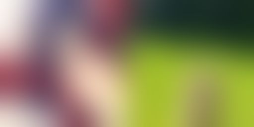 | 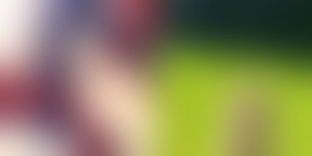 | 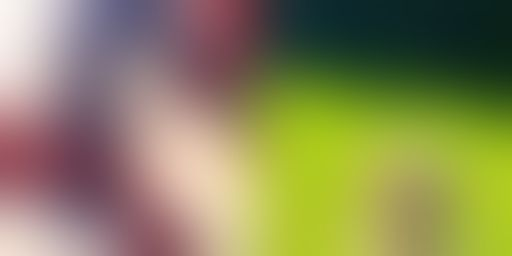 | 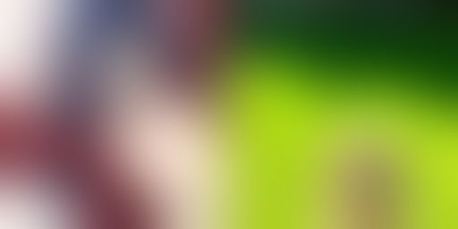 |

**Before / after steering panels** (original base → steered):

| | | |
|---|---|---|
|  |  |  |
|  |  | |

---

## 6. Stage 3 — Fine-tuning

### 6.1 LoRA (Stage 3A)

As an initial fine-tuning experiment we trained a rank-16 LoRA adapter on the `DRDELATV/SHORT_NSFW` dataset (188 images with explicit text captions) for 500 steps.

| Setting | Value |
|---|---|
| Base model | Z-Image (non-distilled) |
| Dataset | `DRDELATV/SHORT_NSFW` (188 rows) |
| LoRA rank / alpha | 16 / 16 |
| Target modules | `to_q`, `to_k`, `to_v`, `to_out.0` (attention projections) |
| Trainable params | ~16.7M (0.27% of 6.15B) |
| Steps | 500 |
| Effective batch | 4 (batch×grad_accum = 1×4) |
| Learning rate | 1e-4 cosine |
| Final loss | 7–20 |

Adapter saved to `/scratch/training/lora_nsfw_r16/final_adapter`.

Evaluation (25 prompts — 15 NSFW + 10 SFW, 3 columns: base / +LoRA / Turbo+LoRA-transfer):

| Metric | Observation |
|---|---|
| Visual difference vs base | Visible on NSFW prompts at 50 steps |
| SFW quality preservation | Maintained (no catastrophic forgetting at 500 steps) |
| Turbo transfer | 272/793 tensors transferred (521 frozen base weights expected missing) |
| Inference overhead | ~30% slower than base due to PEFT runtime hooks |

Representative panels: [`outputs/eval_lora/panels/`](outputs/eval_lora/panels/) · Summary: [`outputs/eval_lora/summary_grid.jpg`](outputs/eval_lora/summary_grid.jpg)

**Sample panels (Base | +LoRA | Turbo+LoRA):**

| | | |
|---|---|---|
|  |  |  |

### 6.2 Full Fine-tune (Stage 3B)

To eliminate the PEFT runtime overhead at deployment time, we provide a full fine-tune script that trains all transformer parameters directly. The learned delta is baked into the weight matrices and the resulting checkpoint is a plain `ZImageTransformer2DModel` with no adapter dependency.

**Key differences from LoRA:**

| Axis | LoRA | Full fine-tune |
|---|---|---|
| Trainable params | 16.7M (0.27%) | 6.15B (100%) |
| Learning rate | 1e-4 | **5e-6** (20× smaller) |
| Weight decay | 0.01 | **0.05** (stronger regularisation) |
| LR schedule | Cosine | **Cosine + linear warm-up** (200 steps) |
| Gradient checkpointing | Not needed | Optional (saves ~40% VRAM via `--grad_ckpt`) |
| Deployment checkpoint | adapter + base model | **single `ZImageTransformer2DModel` dir** |
| Inference speed | ~30% slower (PEFT hooks) | **Identical to base** |

**Training stability fixes (vs. naïve full fine-tune):**

| Problem | Fix |
|---|---|
| Loss in hundreds (variable spatial resolution) | Per-sample spatial mean before MSE — all aspect ratios contribute equally |
| Catastrophic spikes at high-noise timesteps (σ→1) | **Min-SNR-5 loss weighting** — `w = min(SNR(t), 5)` suppresses near-pure-noise steps |
| Uniform U[0,T] timestep sampling hits extremes | **Logit-normal sampling** (σ=0.8) — biases towards middle timesteps (σ≈0.5) |
| LR=2e-5 caused divergence at step ~110 | Reduced to **5e-6** with 200-step warmup |

**Training dataset:** [`DownFlow/nsfw`](https://huggingface.co/datasets/DownFlow/nsfw) — 277 images built from `lora_image_raw/` with the custom dataset pipeline (see Stage 3C).

**Training run:** `fullft_nsfw_run03` — 2000 steps, loss stabilised to 0.1–20 range after warmup.

**Usage:**
```bash
# Default: DownFlow/nsfw, 2000 steps, lr=5e-6, batch=1, grad_accum=4, res=512
python3 stage3_finetune/train_fullft.py

# With gradient checkpointing (saves ~40% VRAM at ~10% speed cost)
python3 stage3_finetune/train_fullft.py --grad_ckpt --steps 2000 \
    --output_dir /scratch/training/fullft_nsfw_run03

# Resume from checkpoint
python3 stage3_finetune/train_fullft.py \
    --resume /scratch/training/fullft_nsfw_run03/checkpoint_01000 \
    --output_dir /scratch/training/fullft_nsfw_run03
```

**Loading the fine-tuned transformer at inference:**
```python
from diffusers import ZImagePipeline, ZImageTransformer2DModel
import torch

pipe = ZImagePipeline.from_pretrained(MODEL_BASE, torch_dtype=torch.bfloat16)
pipe.transformer = ZImageTransformer2DModel.from_pretrained(
    "/scratch/training/fullft_nsfw_run03/final_transformer",
    torch_dtype=torch.bfloat16,
)
pipe = pipe.to("cuda")
# No adapter overhead — runs at base model inference speed
```

**Eval panels** (Base | Fine-tuned | Turbo, 4 columns, 512×512):

Summary: [`outputs/eval_fullft/summary_grid.jpg`](outputs/eval_fullft/summary_grid.jpg)

| | | | |
|---|---|---|---|
|  |  |  |  |
|  |  |  |  |

### 6.3 Dataset Pipeline (Stage 3C)

The training data was built from 277 proprietary images in `lora_image_raw/` using a fully automated captioning pipeline.

**Preprocessing:**
1. Strip top 5% of image (watermark zone)
2. Aspect-preserving resize (shortest side = 512 px)
3. Floor-round both dims to nearest multiple of 16 (for VAE×8 + 2× patch compatibility)
4. Save as JPEG

**Captioning:** vLLM endpoint — `huihui-ai/Huihui-Qwen3.5-2B-abliterated`, 3 sequential calls per image:
1. Ad-check (5 tokens) — skip non-person images
2. EN caption (300 tokens max) — precise anatomical/compositional description
3. ZH caption (300 tokens max) — Simplified Chinese parallel caption

**Deduplication:** `_is_repetitive()` guard (window-6 n-gram threshold 0.4) catches VLM loop failures before write.

**Published dataset:** [`DownFlow/nsfw`](https://huggingface.co/datasets/DownFlow/nsfw) — 277 rows, columns: `image`, `text_en`, `text_cn`.

| Script | Purpose |
|---|---|
| `build_dataset.py` | Full pipeline: strip → resize → round → VLM caption → `metadata.jsonl` |
| `recaption_long.py` | One-shot fix: re-caption entries where EN > 400 words or ZH > 400 chars |
| `push_to_hub.py` | Push `finetune_dataset/` to HF Hub as `DownFlow/nsfw` (renames `text_zh` → `text_cn`) |

---

### 6.4 Artist Identity LoRA (Stage 3D)

To teach Z-Image Turbo to reproduce specific artist identities via trigger-token captions, we trained a rank-32 LoRA on 200 images across 8 high-recurrence artists (≥21 images each) from `fuliji_dataset.parquet`.

**Dataset (filtered):**

| Artist | Images |
|---|---|
| 萌芽儿o0 | 30 |
| 年年 | 26 |
| 封疆疆v | 26 |
| 焖焖碳 | 26 |
| 星之迟迟 | 25 |
| 蠢沫沫 | 23 |
| 雨波HaneAme | 23 |
| 清水由乃 | 21 |

**Training configuration (`lora_artist_turbo_run01`):**

| Setting | Value |
|---|---|
| Base model | Z-Image Turbo |
| Dataset | 200 images, 8 artists (`--min_count 21`) |
| LoRA rank / alpha | 32 / 32 |
| Target modules | `to_q`, `to_k`, `to_v`, `w1`, `w2`, `w3` |
| Trainable params | ~39M |
| Steps | 3000 (~60 epochs over 200 images, eff_batch=4) |
| LR | 1e-4 cosine, 100-step warmup |
| Regularisation | reg_ratio=0.25 (reg dataset interleaved), flip_aug, caption_dropout=0.05 |
| EMA | decay=0.9999 |
| Timestep bias | 1.2 (biases towards high-noise steps) |
| Final smooth loss | ~0.44 |

**Training loss curve:**

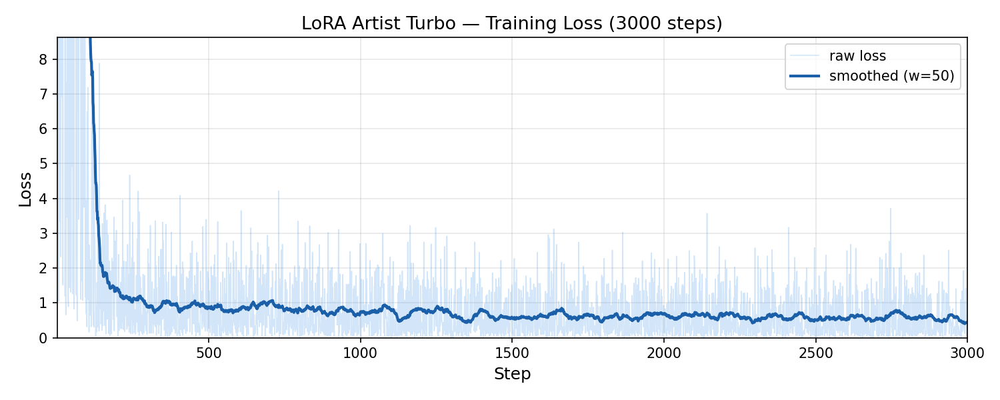

**Final eval — 8 trained artists** (Original photo | Z-Image Turbo base | LoRA, 512×512):

| 萌芽儿o0 | 年年 | 封疆疆v | 焖焖碳 |
|---|---|---|---|
| 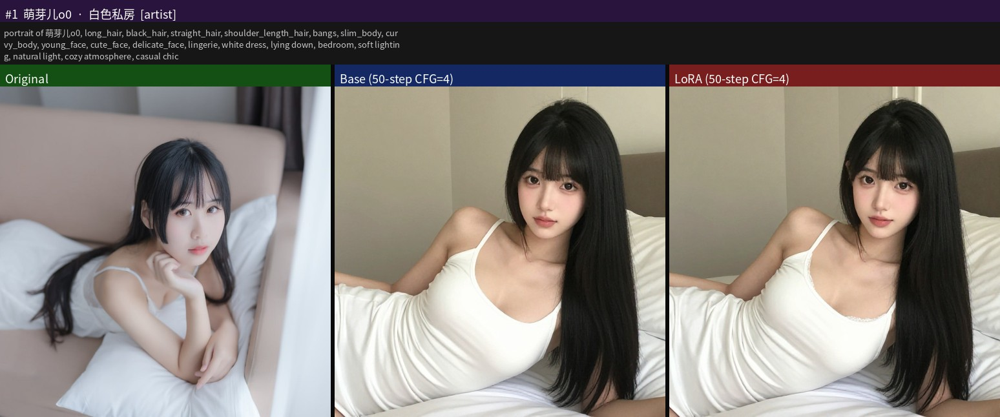 | 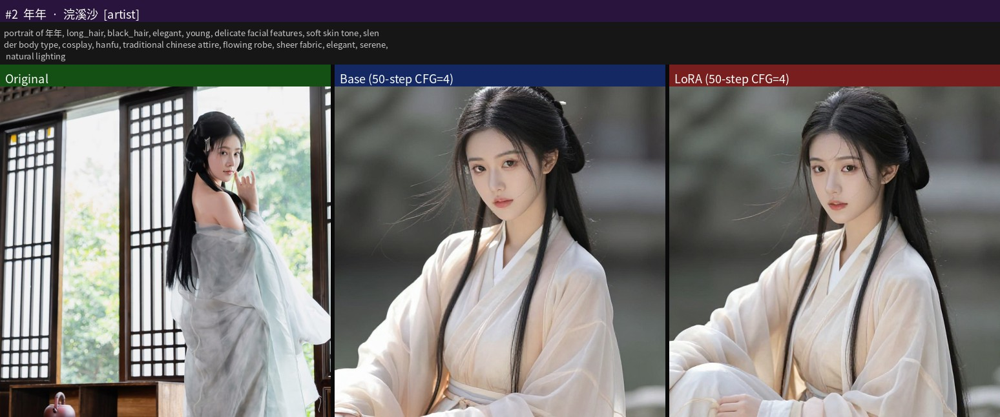 | 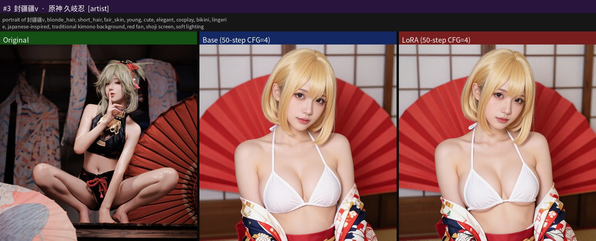 | 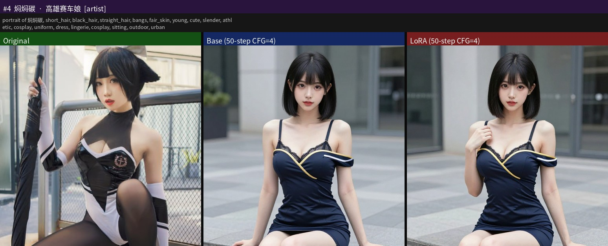 |

| 星之迟迟 | 蠢沫沫 | 雨波HaneAme | 清水由乃 |
|---|---|---|---|
| 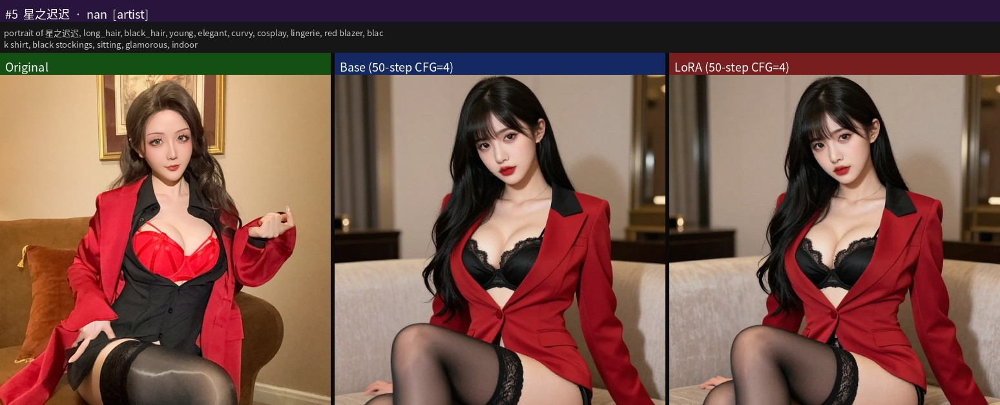 | 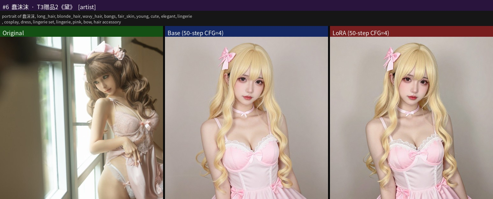 | 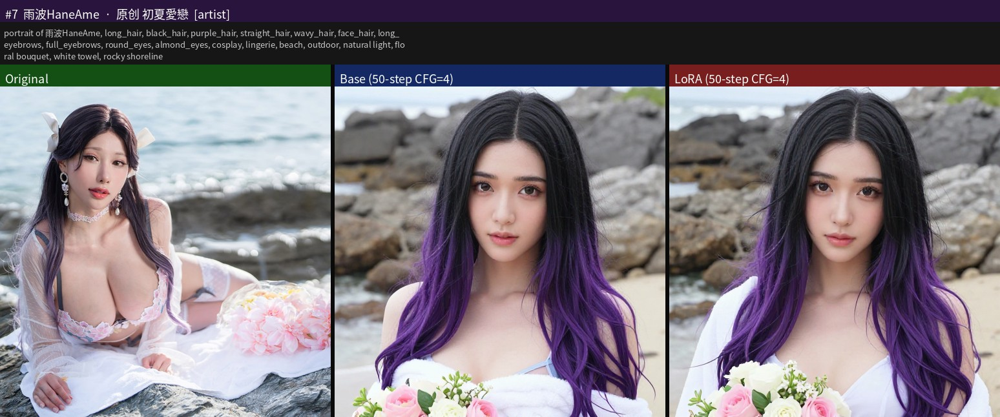 | 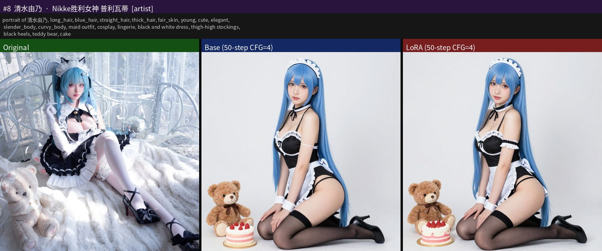 |

**SFW anchor checks** (confirms no catastrophic forgetting):

| | | |
|---|---|---|
| 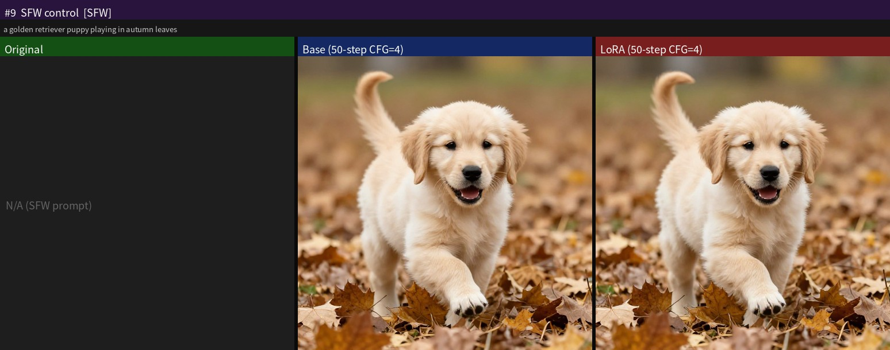 | 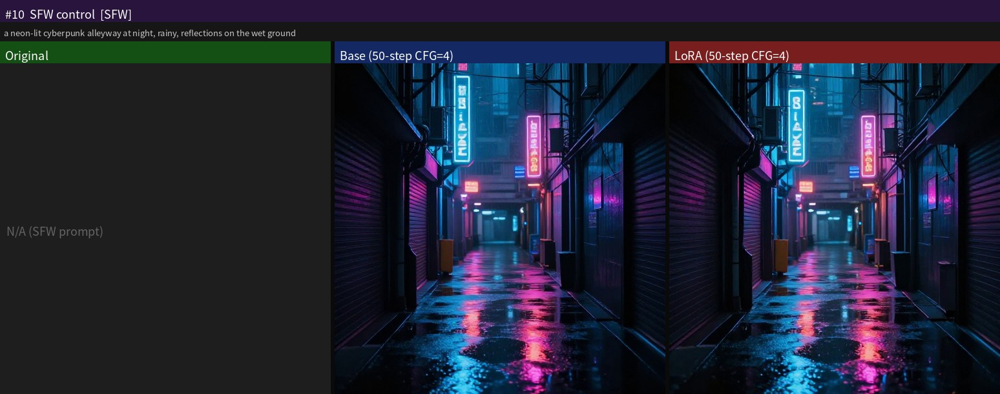 | 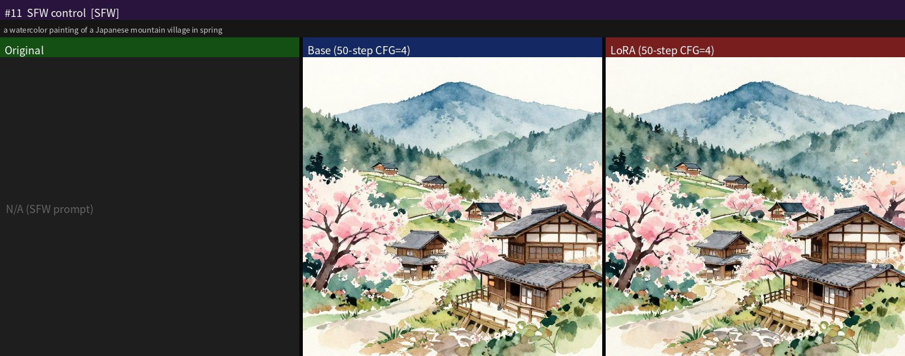 |

**Checkpoint progression eval dirs** (Original photo | Z-Image Turbo base | LoRA, 512×512, seed=42):

| Checkpoint | Output dir | Summary grid |
|---|---|---|
| Step 500 EMA | [`outputs/eval_lora_artist_turbo_step500/`](outputs/eval_lora_artist_turbo_step500/) |  |
| Step 1000 EMA | [`outputs/eval_lora_artist_turbo_step1000/`](outputs/eval_lora_artist_turbo_step1000/) |  |
| Step 1500 EMA | [`outputs/eval_lora_artist_turbo_step1500/`](outputs/eval_lora_artist_turbo_step1500/) |  |
| Step 2500 EMA | [`outputs/eval_lora_artist_turbo_step2500/`](outputs/eval_lora_artist_turbo_step2500/) |  |
| Final (3000 EMA) | [`outputs/eval_lora_artist_turbo_final/`](outputs/eval_lora_artist_turbo_final/) | 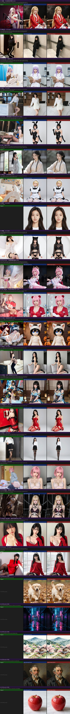 |

**LoRA scale experiments** — at default scale=1.0 (alpha/rank=1) differences are subtle on Turbo; scale=2.0 amplifies without artefacts:

```bash
python3 stage3_finetune/eval_lora_artist.py \
    --turbo \
    --adapter /scratch/training/lora_artist_turbo_run01/final_adapter \
    --lora_scale 2.0 --res 512
```

**Loading at inference:**
```python
from peft import PeftModel
pipe = ZImagePipeline.from_pretrained(MODEL_TURBO, torch_dtype=torch.bfloat16)
pipe.transformer = PeftModel.from_pretrained(
    pipe.transformer,
    "/scratch/training/lora_artist_turbo_run01/final_adapter",
    is_trainable=False,
)
pipe = pipe.to("cuda")
image = pipe("portrait of 年年, long_hair, black_hair, elegant", num_inference_steps=8).images[0]
```

---

### 5.7 Planned Future Work

#### Next Step 1 — Scale-up Training on Full Fuliji Dataset

The current `DownFlow/Z-Image-Turbo-Fuli` adapter was trained on 200 images from 8 artists (≥21 images each). The natural next step is to scale up to the **full 1177-image, 405-artist dataset** ([`DownFlow/fuliji`](https://huggingface.co/datasets/DownFlow/fuliji)):

- Increase LoRA rank (32 → 64) to better represent a larger artist vocabulary
- Train longer (3000 → 6000+ steps) to allow sufficient per-artist exposure at scale
- Experiment with per-artist learning-rate scheduling (higher LR for low-count artists)
- Consider hierarchical captioning: global style tags + per-artist trigger token

#### Next Step 2 — Editing Support

Z-Image-Omni-Base (not yet released) is the editing-capable variant. Once available:

- Integration of Z-Image-Edit as a drop-in for the current pipeline
- IP2P-style (InstructPix2Pix) editing: change outfit, background, expression via text instruction
- Masking-based inpainting: region-localised edits without full re-generation
- Benchmark against `LonelVino/edit_bench`, `facebook/emu_edit_test_set`, and `osunlp/magic_brush` (all cached locally)
- Combine with the artist LoRA: generate in an artist's style, then edit via instruction

---

## 7. Repository Structure

```
zimage-nitro/
├── README.md
├── .gitignore
├── .env.example                    # Template — copy to .env and fill in
├── requirements.txt
│
├── stage1_analysis/                # ✅ Complete
│   ├── compare_models.py           # Block-by-block weight similarity analysis (521 tensors)
│   └── generate_comparisons.py     # 93 side-by-side comparison pairs
│
├── stage2_abliteration/            # ✅ Complete
│   ├── refusal_study.py            # VLM captioning + generation refusal baseline
│   ├── find_directions.py          # Mean-diff NSFW direction extraction per layer
│   ├── steer_weights.py            # Rank-1 weight ablation (W' = W - α·d(d⊤W))
│   ├── eval_steered.py             # Original vs. steered side-by-side evaluation
│   └── directions/                 # Saved direction vectors (nsfw_vs_sfw.pt)
│
├── stage3_finetune/                # ✅ Complete
│   ├── train_lora.py               # LoRA fine-tuning (rank=16, attn, 500 steps)
│   ├── train_fullft.py             # Full fine-tuning (all 6.15B params, 2000 steps, min-SNR-5)
│   ├── build_dataset.py            # Dataset pipeline: strip → resize → ×16 → VLM caption
│   ├── recaption_long.py           # Fix overlong captions (>400 words/chars) in-place
│   ├── push_to_hub.py              # Push finetune_dataset → HF Hub as DownFlow/nsfw
│   └── eval_lora.py                # 3-column evaluation (base / LoRA / Turbo+transfer)
│
├── stage4_editing/                 # 🔜 Planned
│   ├── edit_pipeline.py            # Z-Image-Edit inference wrapper
│   └── eval_editing.py             # Benchmark on edit_bench / emu_edit / magic_brush
│
└── outputs/                        # Representative generated artifacts
    ├── summary_grid.jpg            # 93-pair Stage 1 summary
    ├── metadata.json               # Stage 1 per-pair metadata
    ├── pairs/                      # 5 representative Stage 1 comparison panels
    ├── alpha_sweep/                # 5 alpha ablation panels (α = 0.00 → 0.40)
    ├── refusal_study/              # Stage 2A — 5 panels + summary_grid
    │   ├── summary_grid.jpg
    │   └── metadata.json
    ├── eval_steered/               # Stage 2D — 5 panels + summary_grid
    │   ├── summary_grid.jpg
    │   └── metadata.json
    └── eval_lora/                  # Stage 3A LoRA eval — 5 panels + summary_grid
        ├── summary_grid.jpg
        └── metadata.json
```

---

## 7. Citation

```bibtex
@article{team2025zimage,
  title={Z-Image: An Efficient Image Generation Foundation Model with Single-Stream Diffusion Transformer},
  author={Z-Image Team},
  journal={arXiv preprint arXiv:2511.22699},
  year={2025}
}

@article{liu2025decoupled,
  title={Decoupled DMD: CFG Augmentation as the Spear, Distribution Matching as the Shield},
  author={Dongyang Liu and Peng Gao and David Liu and Ruoyi Du and Zhen Li and
          Qilong Wu and Xin Jin and Sihan Cao and Shifeng Zhang and
          Hongsheng Li and Steven Hoi},
  journal={arXiv preprint arXiv:2511.22677},
  year={2025}
}

@article{jiang2025distribution,
  title={Distribution Matching Distillation Meets Reinforcement Learning},
  author={Jiang, Dengyang and Liu, Dongyang and Wang, Zanyi and Wu, Qilong
          and Jin, Xin and Liu, David and Li, Zhen and Wang, Mengmeng
          and Gao, Peng and Yang, Harry},
  journal={arXiv preprint arXiv:2511.13649},
  year={2025}
}
```

---

## Appendix A — Running the Code

### A.0 — Setup

```bash
# Clone the repo
git clone https://github.com/GCStream/Z-Image-Turbo-Fuli.git
cd Z-Image-Turbo-Fuli

# Install dependencies (requires PyTorch ≥ 2.3 with CUDA/ROCm)
pip install git+https://github.com/huggingface/diffusers
pip install -r requirements.txt

# Required for artist LoRA training and eval
pip install peft safetensors huggingface_hub

# Optional: CJK font for eval panels with Chinese artist names
mkdir -p assets/fonts
wget -q "https://github.com/googlefonts/noto-cjk/raw/main/Sans/OTC/NotoSansCJK-Regular.ttc" \
     -O assets/fonts/NotoSansCJK-Regular.ttc

# Set your HuggingFace token (needed for push commands)
echo "HF_TOKEN=hf_your_token_here" > .env
```

---

### A.1 — Inference

#### Quick inference with the published merged model (no PEFT needed)

```python
import torch
from diffusers import DiffusionPipeline

pipe = DiffusionPipeline.from_pretrained(
    "DownFlow/Z-Image-Turbo-Fuli",
    torch_dtype=torch.bfloat16,
).to("cuda")

# Prepend "by <artist>," to trigger artist style.
# Trained artists: 萌芽儿o0, 年年, 封疆疆v, 焖焖碳, 星之迟迟, 蠢沫沫, 雨波HaneAme, 清水由乃
image = pipe(
    prompt="by 蠢沫沫, 1girl, soft lighting, smile",
    num_inference_steps=8,
    guidance_scale=0.0,   # Z-Image Turbo is CFG-free
    height=512, width=512,
).images[0]
image.save("output.png")
```

#### Inference with the LoRA adapter (PEFT, dynamic loading)

```python
import torch
from diffusers import DiffusionPipeline
from peft import PeftModel

pipe = DiffusionPipeline.from_pretrained(
    "Tongyi-MAI/Z-Image-Turbo",
    torch_dtype=torch.bfloat16,
).to("cuda")

pipe.transformer = PeftModel.from_pretrained(
    pipe.transformer, "DownFlow/Z-Image-Turbo-Fuli-LoRA"
)

image = pipe(
    prompt="by 年年, 1girl, white dress, cherry blossoms",
    num_inference_steps=8,
    guidance_scale=0.0,
).images[0]
```

#### Adjust LoRA scale at runtime

```python
# After loading the PeftModel, before inference:
for module in pipe.transformer.modules():
    if hasattr(module, "scaling"):
        module.scaling = {k: v * 1.5 for k, v in module.scaling.items()}
# Recommended range: 1.0–2.0. Values > 3 may cause artefacts.
```

#### Serve with vLLM (OpenAI-compatible endpoint)

```bash
pip install "vllm>=0.8.0"

# Use the merged model — no PEFT dependency at serve time
vllm serve DownFlow/Z-Image-Turbo-Fuli \
    --task generate \
    --dtype bfloat16 \
    --max-model-len 512 \
    --port 8000
```

```bash
# Call via curl
curl http://localhost:8000/v1/images/generations \
  -H "Content-Type: application/json" \
  -d '{
    "model": "DownFlow/Z-Image-Turbo-Fuli",
    "prompt": "by 蠢沫沫, 1girl, smile",
    "n": 1,
    "size": "512x512"
  }'
```

---

### A.2 — Training

#### A.2.1 — Artist Identity LoRA (Stage 3D)

Train a rank-32 LoRA on the Fuliji dataset to teach artist trigger tokens.

**Z-Image Turbo — 8 artists, ~200 images, 3000 steps (our published run):**

```bash
python3 stage3_finetune/train_lora_artist.py \
    --model_path /path/to/Z-Image-Turbo \
    --parquet /path/to/fuliji_dataset.parquet \
    --min_count 21 \
    --reg_dataset finetune_dataset \
    --reg_ratio 0.25 \
    --steps 3000 \
    --batch_size 1 --grad_accum 4 \
    --lr 1e-4 --warmup_steps 100 --weight_decay 0.01 \
    --rank 32 --res 512 --save_every 500 \
    --grad_ckpt --flip_aug \
    --caption_dropout 0.05 --ema_decay 0.9999 --timestep_bias 1.2 \
    --output_dir /scratch/training/lora_artist_turbo_run01
```

**Z-Image base — all 405 artists, 1177 images, 2000 steps:**

```bash
python3 stage3_finetune/train_lora_artist.py \
    --parquet /path/to/fuliji_dataset.parquet \
    --reg_dataset finetune_dataset \
    --reg_ratio 0.25 \
    --steps 2000 \
    --batch_size 1 --grad_accum 4 \
    --lr 1e-4 --warmup_steps 100 --weight_decay 0.01 \
    --rank 32 --res 512 --save_every 500 \
    --grad_ckpt --flip_aug \
    --caption_dropout 0.05 --ema_decay 0.9999 --timestep_bias 1.2 \
    --output_dir /scratch/training/lora_artist_run01
```

**Resume from a checkpoint:**

```bash
python3 stage3_finetune/train_lora_artist.py \
    --model_path /path/to/Z-Image-Turbo \
    --parquet /path/to/fuliji_dataset.parquet \
    --min_count 21 \
    --resume /scratch/training/lora_artist_turbo_run01/adapter_checkpoint_03000_ema \
    --resume_step 3000 \
    --steps 5000 \
    ...same flags as original run... \
    --output_dir /scratch/training/lora_artist_turbo_run01
```

Key arguments:

| Argument | Default | Description |
|---|---|---|
| `--parquet` | — | Path to `fuliji_dataset.parquet` |
| `--min_count N` | 1 | Only include artists with ≥ N images |
| `--rank` | 32 | LoRA rank |
| `--reg_ratio` | 0.25 | Fraction of steps using regularisation images |
| `--ema_decay` | 0.9999 | EMA decay for adapter weights (0 = off) |
| `--timestep_bias` | 1.2 | Bias sampling toward style (low-noise) timesteps |
| `--lora_scale` | — | (eval only) scale the adapter influence |
| `--resume` | — | Path to checkpoint dir to continue from |
| `--resume_step` | 0 | Global step of the resumed checkpoint |

#### A.2.2 — Full Fine-tune (Stage 3B)

```bash
python3 stage3_finetune/train_fullft.py \
    --dataset finetune_dataset \
    --text_col text_en \
    --steps 2000 \
    --batch_size 1 --grad_accum 4 \
    --lr 8e-6 --warmup_steps 200 --weight_decay 0.01 \
    --res 512 --save_every 500 --grad_ckpt \
    --flip_aug --caption_dropout 0.1 --ema_decay 0.9999 --timestep_bias 1.2 \
    --output_dir /scratch/training/fullft_run01
```

#### A.2.3 — Build a local fine-tune dataset

```bash
# Prepare images: resize to 512, strip top 5% (watermark), write metadata.jsonl
python3 stage3_finetune/build_dataset.py \
    --input_dir lora_image_raw \
    --output_dir finetune_dataset \
    --strip_top_frac 0.05 \
    --training_res 512

# Re-caption with a long-form VLM caption (requires qwen2.5-vl or similar)
python3 stage3_finetune/recaption_long.py
```

---

### A.3 — Evaluation

#### A.3.1 — Artist LoRA eval panels (3-column: original | base | LoRA)

```bash
# Evaluate the final Turbo LoRA adapter — 25 random artists
python3 stage3_finetune/eval_lora_artist.py \
    --turbo \
    --adapter /scratch/training/lora_artist_turbo_run01/final_adapter \
    --n_artist 25 --n_sfw 5 --res 512 --seed 42 \
    --out outputs/eval_lora_artist_turbo_final

# Evaluate only the 8 trained artists
python3 stage3_finetune/eval_lora_artist.py \
    --turbo \
    --adapter /scratch/training/lora_artist_turbo_run01/final_adapter \
    --artist_filter 萌芽儿o0 年年 封疆疆v 焖焖碳 星之迟迟 蠢沫沫 雨波HaneAme 清水由乃 \
    --n_sfw 5 --res 512 --seed 42 \
    --out outputs/eval_lora_artist_turbo_trained

# Evaluate an intermediate checkpoint
python3 stage3_finetune/eval_lora_artist.py \
    --turbo \
    --adapter /scratch/training/lora_artist_turbo_run01/adapter_checkpoint_01000_ema \
    --n_artist 25 --n_sfw 5 --res 512 \
    --out outputs/eval_lora_artist_turbo_step1000

# Adjust LoRA scale (default 1.0; try 1.5–2.0 for stronger identity)
python3 stage3_finetune/eval_lora_artist.py \
    --turbo \
    --adapter /scratch/training/lora_artist_turbo_run01/final_adapter \
    --lora_scale 2.0 \
    --artist_filter 蠢沫沫 年年 \
    --out outputs/eval_scale2
```

Key `eval_lora_artist.py` arguments:

| Argument | Default | Description |
|---|---|---|
| `--turbo` | off | Use Z-Image-Turbo (8-step, CFG=0) |
| `--adapter PATH` | — | Path to PEFT adapter directory |
| `--lora_scale FLOAT` | 1.0 | Multiply adapter scaling dict |
| `--artist_filter NAME …` | — | Evaluate specific artists only |
| `--n_artist INT` | 25 | Number of randomly sampled artists |
| `--n_sfw INT` | 5 | SFW prompts to include |
| `--res INT` | 512 | Output resolution |

#### A.3.2 — Full fine-tune eval (4-column panels)

```bash
python3 stage3_finetune/eval_fullft.py \
    --ft_path /scratch/training/fullft_run01/final_transformer \
    --n_train 15 --n_sfw 5 --res 512 --steps 50 --seed 42
```

#### A.3.3 — Stage 1 & 2 evals

```bash
# Weight-space comparison: cosine similarity, norm ratios, per-layer stats
python3 stage1_analysis/compare_models.py

# Generate 100 base model comparison pairs (Z-Image vs Z-Image Turbo)
python3 stage1_analysis/generate_comparisons.py --n 100 --res 512 --seed 42

# Abliteration evaluation
python3 stage2_abliteration/eval_steered.py --n 30 --res 512
```

---

### A.4 — Upload to HuggingFace

#### Upload the LoRA adapter only (lightweight, ~271 MB)

```bash
# Set token
export HF_TOKEN=hf_your_token_here

# Upload adapter files to your repo
hf upload YOUR_USERNAME/your-lora-repo \
    /path/to/final_adapter \
    --type model \
    --commit-message "Upload LoRA adapter"
```

> Make sure `adapter_config.json` has `"base_model_name_or_path": "Tongyi-MAI/Z-Image-Turbo"` and  
> `"task_type": "FEATURE_EXTRACTION"` (not `null`) before uploading.

#### Merge LoRA into base weights and upload (~20 GB merged model)

```bash
set -a && source .env && set +a

python3 scripts/merge_and_push.py \
    --base_path /path/to/Z-Image-Turbo \
    --adapter_path /path/to/final_adapter \
    --output_dir /tmp/merged_model \
    --repo_id YOUR_USERNAME/your-merged-model-repo
    # Add --private to keep the repo private
```

This script:
1. Loads the base pipeline (bfloat16)
2. Applies the adapter with `PeftModel.from_pretrained`
3. Calls `merge_and_unload()` to bake weights permanently
4. Saves the full diffusers pipeline to `--output_dir`
5. Pushes to HuggingFace Hub via `upload_folder`

The resulting model has no PEFT dependency — load with `DiffusionPipeline.from_pretrained` directly and serve with `vllm serve`.

#### Upload the dataset

```bash
python3 stage3_finetune/push_to_hub.py
# Pushes finetune_dataset/ to DownFlow/fuliji (configured inside the script)
```

## Appendix B — Dataset Inventory

| Dataset | Rows | Use |
|---|---|---|
| `nateraw/parti-prompts` | 1,632 | Primary benchmark prompts (11 categories) |
| `Gustavosta/stable-diffusion-prompts` | 73,718 | Style-diverse generation prompts |
| `mlabonne/harmful_behaviors` | 416 | Adversarial instructions → image prompts |
| `mlabonne/harmless_alpaca` | 6,265 | Control set (harmless instructions) |
| `laion/laion-art` | 1,070,744 | Large-scale aesthetic captions |
| `ProGamerGov/synthetic-dataset-1m-dalle3-high-quality-captions` | ~400 (shard) | High-quality DALLE-3 captions |
| `LonelVino/edit_bench` | — | Image editing benchmark (Stage 4) |
| `facebook/emu_edit_test_set` | — | Image editing evaluation (Stage 4) |
| `osunlp/magic_brush` | — | Image editing evaluation (Stage 4) |
| `phiyodr/coco2017` | — | General captioned images (Stage 4) |
| `timbrooks/instructpix2pix-clip-filtered` | — | Instruction-based editing (Stage 4) |
